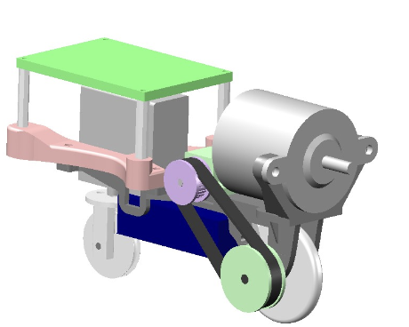
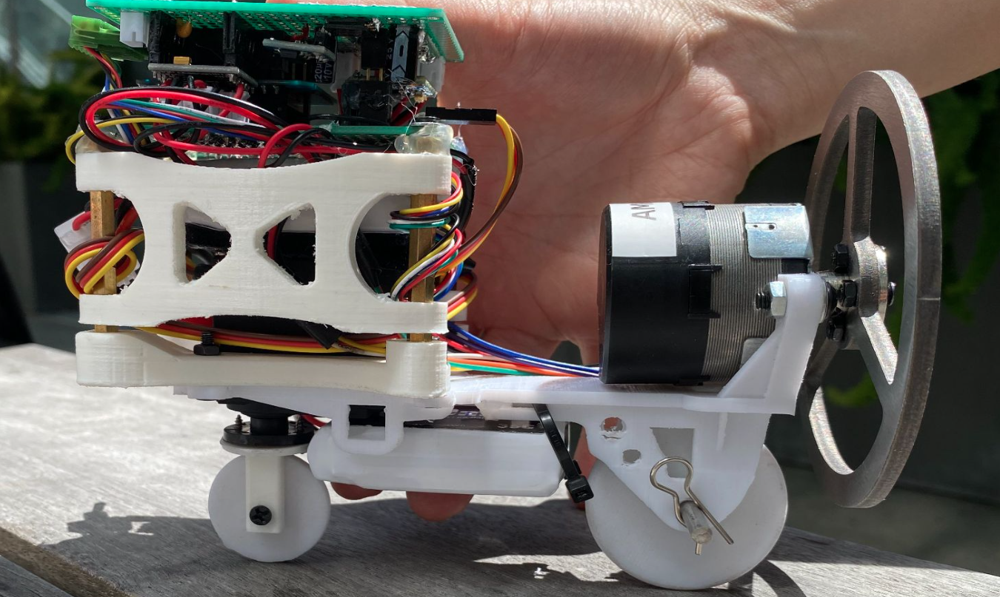
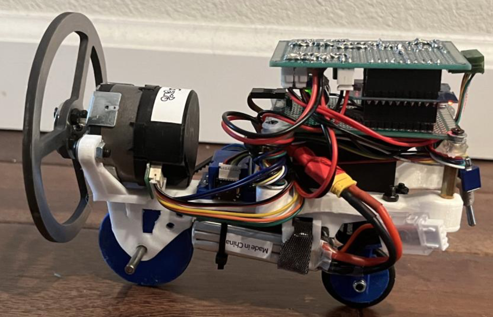
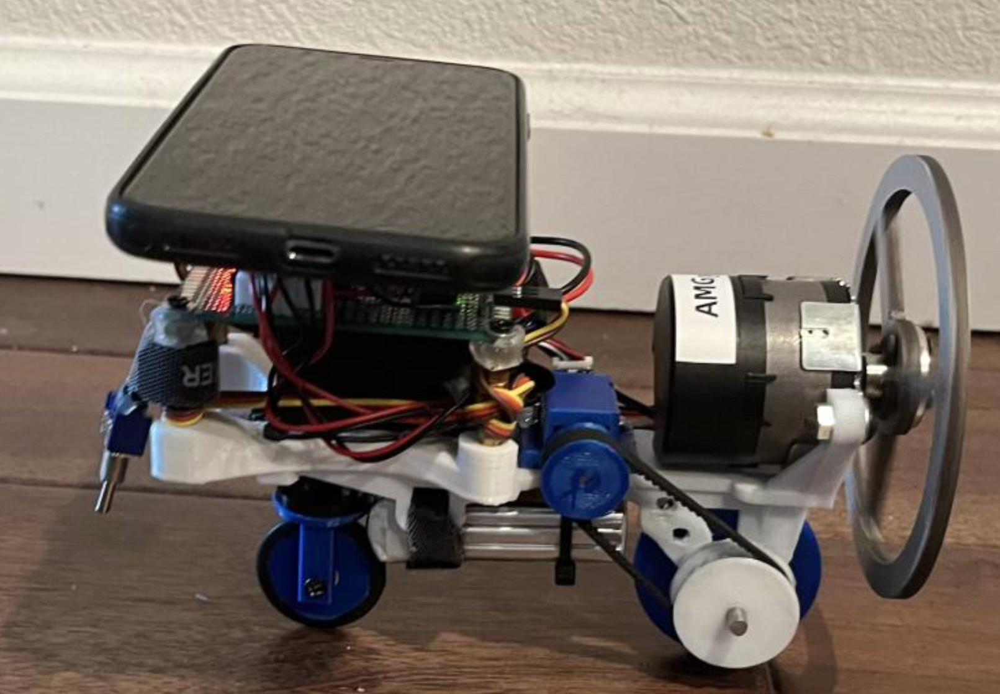
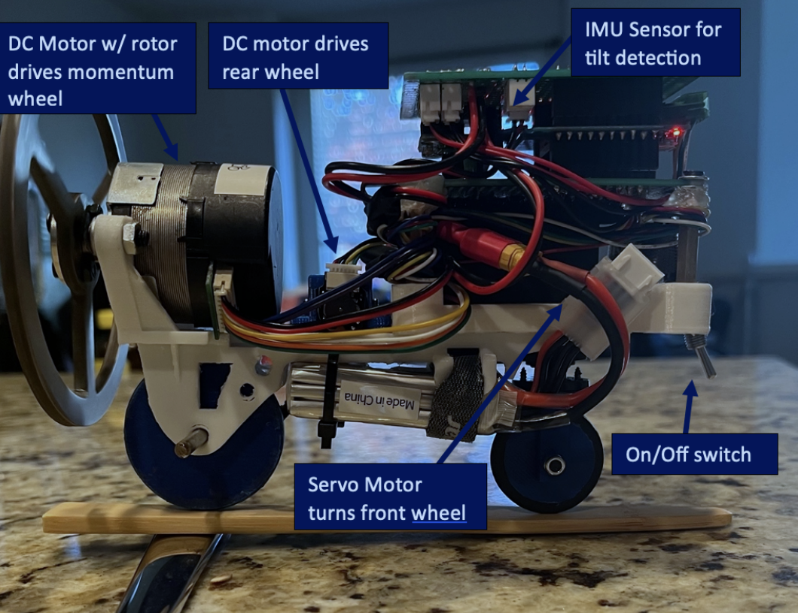
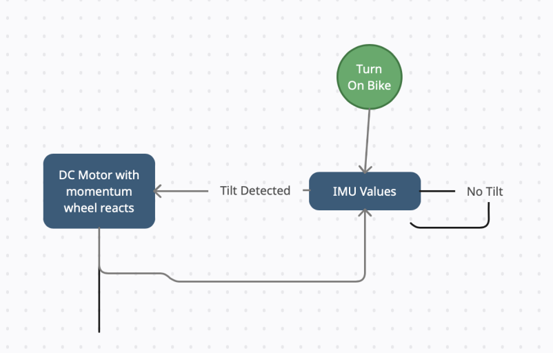
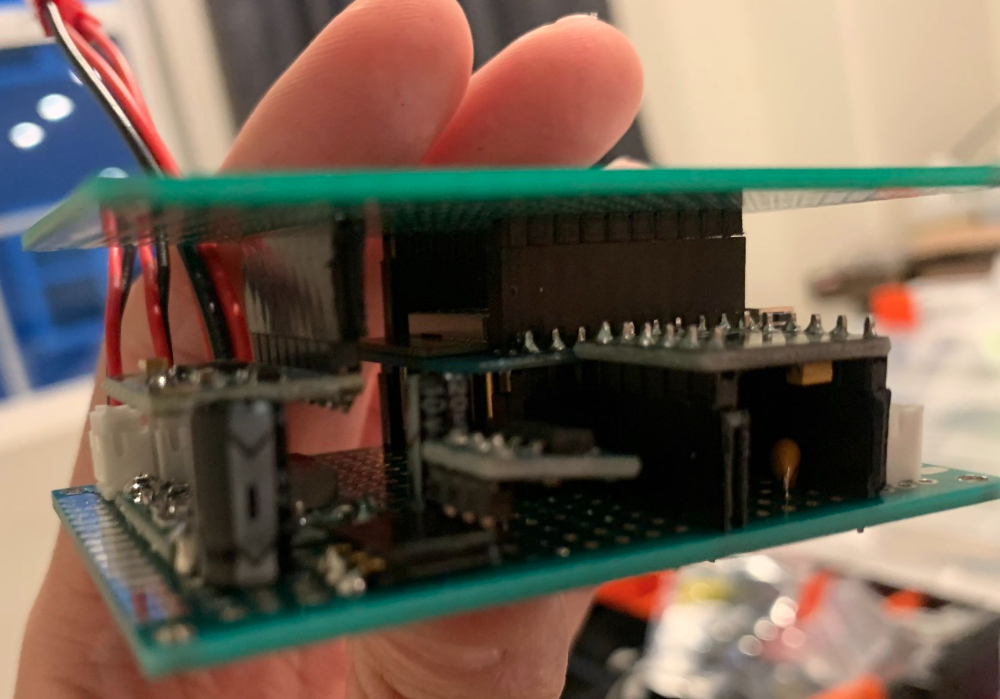
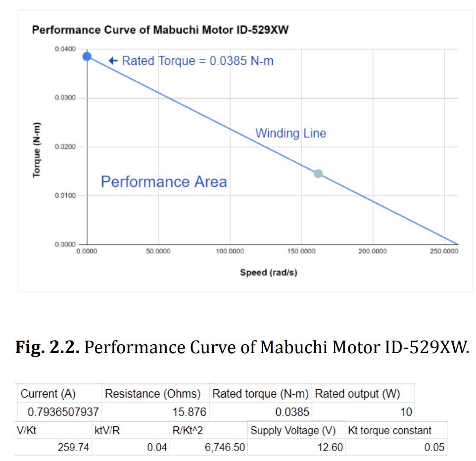

# Balance-Tech — Reaction-Wheel Self-Balancing Bike (ESP32 + LQR)


A two-wheel self-balancing object reminiscent of a motorcycle, with the ability to **move** and **turn**.  
Balancing is achieved using a **reaction (momentum) wheel** driven by a motor, with a **Kalman filter** for tilt estimation and **LQR state feedback** for control.

> **Safety:** the firmware stops the momentum wheel motor when the tilt exceeds **22°**.

---

## Demo / Photos





**Integrated device with labeled actuators and sensors:**



---

## System overview



**Mechanical/coordinate model used in the derivation:**


**Electronics stack (as built):**



The bulk of the circuit design lies within a three “story” structure: three circuit boards with ~1 inch spacing.  
Battery power is wired low to reduce center of mass. A buck converter provides adjustable supply and an AMS1117 (DS1117) provides regulation for the MCU.

---

## Repository layout

- `readme.md` — this document  
- `main_LQR/` — Arduino firmware (`main_LQR.ino`) + MATLAB/LQR notes (`main_LQR/readme.md`)
- `schematic/` — wiring reference (PDF)
- `pics/` — images used by the README
- `CAD Files/` — SolidWorks files
- `STL Files/` — printable STLs
- `datasheet/` — key component datasheets
- `LICENSE` — BSD-2-Clause

---

## Hardware

### Actuators
- **Momentum wheel motor**: generates stabilizing torque by accelerating/decelerating the wheel.
- **Rear drive motor**: propels the bike forward/backward.
- **Steering servo**: turns the front wheel.

### Sensors
- **IMU**: MPU6050 (code) / MPU-6000 class (see datasheet)
- **Quadrature encoder** on the momentum wheel motor (speed + position)

### Controller
- **MCU**: WeMOS D1 mini ESP32 (ESP-WROOM-32)

Board reference:


---

## Wiring / Pin map (firmware defaults)

| Function | GPIO | Notes |
|---|---:|---|
| Momentum wheel PWM | 26 | 20 kHz PWM (`ledc`) |
| Momentum wheel enable/switch | 18 | `M_SW` |
| Momentum wheel direction | 5 | `M_Dir` |
| Encoder A / B | 19 / 23 | `ESP32Encoder.attachHalfQuad(19, 23)` |
| Drive motor PWM (H-bridge) | 33 / 4 | 5 kHz (`D1=33`, `D2=4`) |
| Steering servo PWM | 17 | 50 Hz (`servoChannel`) |
| IMU I²C | SDA=21, SCL=22 | `Wire.begin()` defaults |

Full wiring PDF: [`schematic/sch(just for reference).pdf`](schematic/sch(just%20for%20reference).pdf)

---

## Firmware: build & run

### Toolchain
- Arduino IDE or PlatformIO (Arduino framework)
- Board: “ESP32 Dev Module” (or compatible)

### Libraries
- `ESP32Encoder`
- `I2Cdev` + `MPU6050`
- `Bluepad32`

### Runtime steps
1. Power on the bike.
2. Connect a Bluetooth gamepad (Bluepad32).
3. Calibrate upright offset:
   - **Gamepad:** press **Y + B** (sets `offset = agx`)
   - **Serial:** send `c` (also sets `offset = agx`)
4. Balancing loop runs at ~100 Hz (`loop_time = 10 ms`).

---

## CPU / task structure (ESP32 dual-core)

The firmware pins the remote/gamepad task to core 0, while the balancing loop runs on core 1:

- **CPU Core 1 (`loop`)**
  - Kalman filter (MPU6050 accel + gyro fusion)
  - State computation and LQR control
- **CPU Core 0 (`remote` task)**
  - Read game controller input via Bluepad32
  - Map throttle/brake to drive motor
  - Map joystick to steering servo
  - Provide quick offset calibration via Y+B

---

## Live tuning (Serial)

Send newline-terminated commands:

- `a<value>` → set `K1`
- `s<value>` → set `K2`
- `d<value>` → set `K3`
- `f<value>` → set `K4`
- `o<value>` → set `offset`
- `c` → calibrate (`offset = agx`)

Example:

```txt
a120
s10
d5
f2
```

---

## Control architecture

### State estimation
The IMU provides raw accel/gyro. The code:
- Computes accel tilt (deg) using `atan()`
- Integrates gyro to emphasize short-term dynamics
- Applies a simple Kalman update to fuse accel + gyro (`Kalman_filter()`)

Balancing loop states used in control:
- `euler_angle` (deg): computed as `-agx + offset`
- `gyroXfilter` (deg/s): low-pass filtered angular rate
- `motor_speed` (encoder ticks per loop): `enc_count` each loop
- `motor_pos` (encoder tick accumulator): clamped to `[-110, 110]`

> **Important:** the implementation mixes units (**degrees**, **deg/s**, and **encoder ticks**).  
> The resulting “LQR gains” in firmware should be treated as **tuned state-feedback gains** for these units.


#### Kalman filter (tilt fusion in firmware)

The firmware implements **two independent 1D (scalar) Kalman filters**—one for X tilt (`agx`) and one for Y (`agy`).  
For balancing, the controller mainly uses **X-axis tilt**.

**Accelerometer “measurement”** (deg):

$$
z_k = a_{x,k} = \tan^{-1}\!\left(\frac{a_y}{a_z}\right)\cdot\left(-\frac{180}{\pi}\right)
$$

**Gyro rate + discrete integration** (with $\Delta t=\texttt{loop\_time}/1000$):

$$
\omega_{g,k} = -\frac{(g_x-g_{x0})}{\texttt{GyroRatio}},\qquad
\hat{\theta}^{-}_k = \hat{\theta}_{k-1}+\omega_{g,k}\,\Delta t
$$

**Scalar Kalman update** (with online-estimated $R_k$):

$$
\begin{aligned} P_k^- &= P_{k-1}+Q \\[2pt] K_k &= \frac{P_k^-}{P_k^-+R_k} \\[2pt] \hat{\theta}_k &= \hat{\theta}_k^- + K_k\left(z_k-\hat{\theta}_k^-\right) \\[2pt] P_k &= (1-K_k)P_k^- \end{aligned}
$$

**How $R_k$ is obtained in this project:**  
The code keeps a sliding window of the last 10 accelerometer angles (`a_x[]`) and uses their sample variance as the measurement noise:

$$
\bar{a}_x = \frac{1}{10}\sum_{i=1}^{10} a_{x,i},\qquad
R_k = \frac{1}{9}\sum_{i=1}^{10}\left(a_{x,i}-\bar{a}_x\right)^2
$$

**Tuned constants / initial values (from `main_LQR.ino`):**

$$
P_0=1,\qquad Q=0.0025
$$

**Gyro rate used by the LQR state feedback:**  
In code, the gyro-derived angle rate is converted/scaled to deg/s and then low-pass filtered:

$$
\dot{\theta}_{\mathrm{LPF}}[k]=\alpha\,\dot{\theta}[k]+(1-\alpha)\,\dot{\theta}_{\mathrm{LPF}}[k-1],\qquad \alpha=0.4
$$

Code reference (for clarity):

```txt
v_gyrox     = -gyrox * 1000 / loop_time
gyroXfilter = 0.4 * v_gyrox + 0.6 * gyroXfilter


### State feedback (as implemented)
The controller in `main_LQR.ino` computes:

```txt
u = K1*euler_angle + K2*gyroXfilter - K3*motor_speed - K4*motor_pos
PWM = clamp(u, -255, 255)
```

And applies `PWM` to the momentum wheel motor. If `|euler_angle| > 22°`, the momentum wheel motor output is forced to zero.

---

## Engineering analysis (all equations converted to LaTeX)

### A) External torque requirement (gravity vs. reaction wheel)

The system’s center of mass is above its pivot point, making it inherently unstable.  
If the Euler angle reaches a threshold of 22°, the motor is programmed to stop. Taking that as the maximum operating angle, the maximum gravitational torque is:

$$
T_g = H_1\,M\,g\,\sin(22^\circ) = 0.134~\mathrm{N\cdot m}
$$

The following calculations verify the reaction wheel’s ability to apply a neutralizing torque of equal magnitude or higher.

Motor rotor inertia (solid disk approximation):

$$
I_{\mathrm{motor}} = \frac{1}{2}MR^2 = 2.942\times 10^{-5}~\mathrm{kg\cdot m^2}
$$

Rated motor torque:

$$
T_{\mathrm{motor,rated}} = 0.0385~\mathrm{N\cdot m}
$$

Max angular acceleration:

$$
\alpha_{\max} = \frac{T_{\mathrm{motor,rated}}}{I_{\mathrm{motor}}}
= 1308~\mathrm{rad/s^2}
$$

Reaction wheel inertia (thick ring approximation):

$$
I_w = \frac{1}{2}M\left(R_1^2 + R_2^2\right) = 2.699\times 10^{-4}~\mathrm{kg\cdot m^2}
$$

Max reaction wheel torque:

$$
T_{w,\max} = I_w\,\alpha_{\max} = 0.343~\mathrm{N\cdot m}
$$

Additionally, the performance curve of the BLDC motor shows it is capable of delivering sufficient torque:



---

### B) Optimization of the K gain matrix (LQR)

There are four parameters that describe the system state:
1) Euler angle  
2) angular velocity  
3) reaction wheel speed  
4) reaction wheel position  

A feedback approach is used to bring actual states toward desired states. The gain matrix is computed by LQR to minimize both state error and control effort.

Control law:

$$
u = -K\left(x-x_{\mathrm{desired}}\right)
$$

Quadratic cost function:

$$
J(u)=\int_{0}^{\infty}\left(x^TQx+u^TRu+2x^TNu\right)\,dt
$$

In MATLAB:

$$
K = \mathrm{lqr}(A,B,Q,R)
$$

And for the continuous-time algebraic Riccati equation (CARE):

$$
K = R^{-1}\left(B^TP\right)
$$

$$
A^TP + PA - (PB)R^{-1}(B^TP) + Q = 0
$$

---

### C) Lagrange modeling (reaction-wheel inverted pendulum)

Following the project derivation, the Lagrangian is formed from kinetic and potential energy terms:

$$
L = K_1 + K_2 - V
$$

where $K_1$ and $K_2$ are kinetic energy terms and $V$ is the potential energy.

Euler–Lagrange equations:

$$
\frac{d}{dt}\left(\frac{\partial L}{\partial \dot{\theta}}\right)-\frac{\partial L}{\partial \theta}=T_g,\qquad
\frac{d}{dt}\left(\frac{\partial L}{\partial \dot{\phi}}\right)-\frac{\partial L}{\partial \phi}=T_M
$$

Linearized dynamics used in the report:

$$
T_g = (a+I_w)\ddot{\theta} + I_w\ddot{\phi} = b\theta
$$

where

$$
a = m_bH_1^2 + m_wH_2^2,\qquad
b = (m_bH_1 + m_wH_2)g
$$

and

$$
T_M = I_w(\ddot{\theta}+\ddot{\phi})
$$

---

### D) State-space form

$$
\dot{x}=Ax+Bu,\qquad
x=\begin{bmatrix}
\theta\\[2pt]
\dot{\theta}\\[2pt]
\phi\\[2pt]
\dot{\phi}
\end{bmatrix},\quad
u=T_M
$$

$$
\begin{aligned}
\begin{bmatrix}
\dot{\theta}\\[2pt]
\ddot{\theta}\\[2pt]
\dot{\phi}\\[2pt]
\ddot{\phi}
\end{bmatrix}
&=
\underbrace{\begin{bmatrix}
0 & 1 & 0 & 0\\[2pt]
\frac{b}{a} & 0 & 0 & 0\\[2pt]
0 & 0 & 0 & 1\\[2pt]
-\frac{b}{a} & 0 & 0 & 0
\end{bmatrix}}_{A}
\begin{bmatrix}
\theta\\[2pt]
\dot{\theta}\\[2pt]
\phi\\[2pt]
\dot{\phi}
\end{bmatrix}
+
\underbrace{\begin{bmatrix}
0\\[2pt]
-\frac{1}{a}\\[2pt]
0\\[2pt]
\frac{a+I_w}{aI_w}
\end{bmatrix}}_{B}\,T_M
\end{aligned}
$$

---

### E) Q / R selection

$$
Q=
\begin{bmatrix}
1 & 0 & 0 & 0\\[2pt]
0 & 1 & 0 & 0\\[2pt]
0 & 0 & 0.001 & 0\\[2pt]
0 & 0 & 0 & 1
\end{bmatrix},\qquad
R=1
$$

---

### F) Gains

Final tuned gains in firmware (`main_LQR.ino`):

$$
K =
\begin{bmatrix}
108.4496 & 9.6210 & 5.00 & 1.80
\end{bmatrix}
$$

For the full MATLAB derivation and intermediate results, see: [`main_LQR/readme.md`](main_LQR/readme.md)

---

## CAD / STL

- SolidWorks source: [`CAD Files/`](CAD%20Files/)
- Printable STLs: [`STL Files/`](STL%20Files/)

---

## References

[1] Olfati-Saber, Reza. “Global Stabilization of a Flat Underactuated System: The Inertia Wheel Pendulum.” CDC 2001.  
[2] Çakan, Abdullah, and Ümit Önen. “Multibody Modeling and Balance Control of a Reaction Wheel Inverted Pendulum Using LQR Controller.” 2021.  
[3] Lacey, Tony. “Tutorial: The Kalman Filter.” MIT.  
[4] Nguyen, Hau; Cu, Minh Phuoc. “LQR and Fuzzy Control for Reaction Wheel Inverted Pendulum Model.” 2019.  
[5] Leroy, Etienne. “Guide to Gyro and Accelerometer With Arduino Including Kalman Filtering.” 2011.  
[6] Polotski, Vladimir. “Kalman filter, how do I choose initial P0?” 2017.  
[7] Vathsangam, Harsh. “Complementary filter - My IMU estimation experience.” 2010.  
[8] Abbeel, Pieter. “Optimal Control for Linear Dynamical Systems and Quadratic Cost.” UC Berkeley.  
[9] Sears-Collins, Addison. “Combine the Extended Kalman Filter With LQR.” 2020.  
[10] Quesada, Ricardo. “bluepad32 Arduino platform notes.”  
[11] “1-Axis Attitude Control Module with ATOM.” M5Stack Projects, 2020.

---

## License
BSD-2-Clause — see [`LICENSE`](LICENSE).
